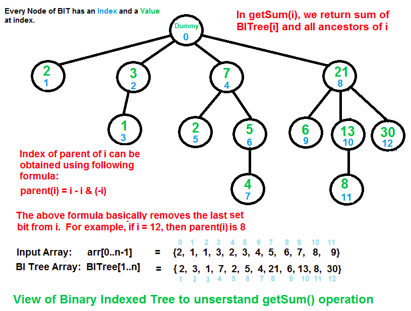

# Minimal-intersection-points-between-roads-with-Binary-Indexed-Tree


## Binary indexed tree explained concept:



## Usage

0.  ```
    $ sudo apt-get install libsfml-dev
    ```

1.  ```
    $ make
    ```
2.  ```
    $ ./main
    ```
3.  ```
    $ make clean
    ```
